# 📚 SƠ ĐỒ USE CASE TOÀN BỘ - HỆ THỐNG QUẢN LÝ BÁN SÁCH

## Mô Tả Hệ Thống
Hệ thống e-commerce bán sách trực tuyến cho phép khách hàng mua sách, quản lý đơn hàng, và admin quản lý toàn bộ hệ thống.

---

## 📊 SƠ ĐỒ USE CASE (PlantUML)

```plantuml
@startuml
!define USECASE(name) (name)
!define ACTOR(name) actor name

left to right direction
skinparam packageStyle rectangle
skinparam actorBackgroundColor #E3F2FD
skinparam usecaseBackgroundColor #FFEB3B

actor "👤 Khách Hàng (USER)" as Customer
actor "👨‍💼 Quản Trị Viên (ADMIN)" as Admin
actor "👑 Quản Lý Hệ Thống (MASTER)" as Master

rectangle "📦 Hệ Thống Quản Lý Bán Sách" {
    
    ' ==================== AUTHENTICATION ====================
    rectangle "🔐 QUẢN LÝ XÁC THỰC & TÀI KHOẢN" {
        usecase "Đăng Ký" as UC_Register
        usecase "Đăng Nhập" as UC_Login
        usecase "Refresh Token" as UC_RefreshToken
        usecase "Đăng Xuất" as UC_Logout
        usecase "Quên Mật Khẩu" as UC_ForgotPassword
        usecase "Đặt Lại Mật Khẩu" as UC_ResetPassword
        usecase "Đổi Mật Khẩu" as UC_ChangePassword
        usecase "Xem Hồ Sơ" as UC_ViewProfile
        usecase "Cập Nhật Hồ Sơ" as UC_UpdateProfile
    }
    
    ' ==================== PRODUCT MANAGEMENT ====================
    rectangle "📚 QUẢN LÝ SẢN PHẨM" {
        usecase "Xem Danh Sách Sách" as UC_ViewProducts
        usecase "Xem Chi Tiết Sách" as UC_ViewProductDetail
        usecase "Tìm Kiếm Sách" as UC_SearchProduct
        usecase "Lọc Theo Danh Mục" as UC_FilterByCategory
        usecase "Lọc Theo Giá" as UC_FilterByPrice
        usecase "Xem Đánh Giá" as UC_ViewRating
        usecase "Thêm Sách Mới" as UC_AddProduct
        usecase "Cập Nhật Sách" as UC_UpdateProduct
        usecase "Xóa Sách" as UC_DeleteProduct
        usecase "Quản Lý Hình Ảnh" as UC_ManageImages
        usecase "Quản Lý Kho" as UC_ManageStock
    }
    
    ' ==================== CATEGORY MANAGEMENT ====================
    rectangle "📑 QUẢN LÝ DANH MỤC" {
        usecase "Xem Danh Mục" as UC_ViewCategories
        usecase "Xem Chi Tiết Danh Mục" as UC_ViewCategoryDetail
        usecase "Thêm Danh Mục" as UC_AddCategory
        usecase "Cập Nhật Danh Mục" as UC_UpdateCategory
        usecase "Xóa Danh Mục" as UC_DeleteCategory
    }
    
    ' ==================== CART ====================
    rectangle "🛒 QUẢN LÝ GIỎ HÀNG" {
        usecase "Xem Giỏ Hàng" as UC_ViewCart
        usecase "Thêm Vào Giỏ" as UC_AddToCart
        usecase "Cập Nhật Số Lượng" as UC_UpdateQuantity
        usecase "Xóa Khỏi Giỏ" as UC_RemoveFromCart
        usecase "Xóa Toàn Bộ Giỏ" as UC_ClearCart
        usecase "Tính Tổng Tiền" as UC_CalculateTotal
    }
    
    ' ==================== ORDER ====================
    rectangle "📋 QUẢN LÝ ĐƠN HÀNG" {
        usecase "Tạo Đơn Hàng" as UC_CreateOrder
        usecase "Xem Chi Tiết Đơn" as UC_ViewOrderDetail
        usecase "Xem Lịch Sử Đơn" as UC_ViewOrderHistory
        usecase "Theo Dõi Đơn Hàng" as UC_TrackOrder
        usecase "Hủy Đơn Hàng" as UC_CancelOrder
        usecase "Yêu Cầu Hủy Đơn" as UC_RequestCancelOrder
        usecase "Duyệt Hủy Đơn" as UC_ApproveCancelOrder
        usecase "Từ Chối Hủy Đơn" as UC_RejectCancelOrder
        usecase "Quản Lý Đơn Hàng" as UC_ManageOrder
        usecase "Cập Nhật Trạng Thái" as UC_UpdateOrderStatus
        usecase "Xem Tất Cả Đơn" as UC_ViewAllOrders
    }
    
    ' ==================== PAYMENT ====================
    rectangle "💳 THANH TOÁN" {
        usecase "Xem Phương Thức Thanh Toán" as UC_ViewPaymentMethods
        usecase "Thanh Toán Trực Tuyến" as UC_OnlinePayment
        usecase "Thanh Toán Khi Nhận" as UC_COD
    }
    
    ' ==================== USER MANAGEMENT ====================
    rectangle "👥 QUẢN LÝ NGƯỜI DÙNG" {
        usecase "Xem Danh Sách Người Dùng" as UC_ViewUsers
        usecase "Xem Chi Tiết Người Dùng" as UC_ViewUserDetail
        usecase "Tạo Tài Khoản" as UC_CreateUser
        usecase "Cập Nhật Người Dùng" as UC_UpdateUser
        usecase "Xóa Người Dùng" as UC_DeleteUser
        usecase "Khóa Tài Khoản" as UC_LockUser
        usecase "Mở Khóa Tài Khoản" as UC_UnlockUser
        usecase "Gán Quyền" as UC_AssignRole
        usecase "Xem Quyền" as UC_ViewRoles
    }
    
    ' ==================== STATISTICS & REPORTS ====================
    rectangle "📊 THỐNG KÊ & BÁO CÁO" {
        usecase "Xem Thống Kê Tổng Quát" as UC_ViewDashboard
        usecase "Thống Kê Theo Ngày" as UC_StatsByDay
        usecase "Thống Kê Theo Tháng" as UC_StatsByMonth
        usecase "Thống Kê Doanh Thu" as UC_RevenueStats
        usecase "Thống Kê Đơn Hàng" as UC_OrderStats
        usecase "Khách Hàng Top" as UC_TopCustomers
        usecase "Sản Phẩm Bán Chạy" as UC_TopProducts
        usecase "Xuất Báo Cáo PDF" as UC_ExportPDF
    }
    
    ' ==================== RELATIONSHIPS - CUSTOMER ====================
    Customer --> UC_Register
    Customer --> UC_Login
    Customer --> UC_RefreshToken
    Customer --> UC_Logout
    Customer --> UC_ForgotPassword
    Customer --> UC_ChangePassword
    Customer --> UC_ViewProfile
    Customer --> UC_UpdateProfile
    
    Customer --> UC_ViewProducts
    Customer --> UC_ViewProductDetail
    Customer --> UC_SearchProduct
    Customer --> UC_FilterByCategory
    Customer --> UC_FilterByPrice
    Customer --> UC_ViewRating
    
    Customer --> UC_ViewCategories
    Customer --> UC_ViewCategoryDetail
    
    Customer --> UC_ViewCart
    Customer --> UC_AddToCart
    Customer --> UC_UpdateQuantity
    Customer --> UC_RemoveFromCart
    Customer --> UC_ClearCart
    Customer --> UC_CalculateTotal
    
    Customer --> UC_CreateOrder
    Customer --> UC_ViewOrderDetail
    Customer --> UC_ViewOrderHistory
    Customer --> UC_TrackOrder
    Customer --> UC_RequestCancelOrder
    
    Customer --> UC_ViewPaymentMethods
    Customer --> UC_OnlinePayment
    Customer --> UC_COD
    
    ' ==================== RELATIONSHIPS - ADMIN ====================
    Admin --> UC_Login
    Admin --> UC_RefreshToken
    Admin --> UC_Logout
    Admin --> UC_ViewProfile
    Admin --> UC_UpdateProfile
    
    Admin --> UC_ViewProducts
    Admin --> UC_AddProduct
    Admin --> UC_UpdateProduct
    Admin --> UC_DeleteProduct
    Admin --> UC_ManageImages
    Admin --> UC_ManageStock
    
    Admin --> UC_ViewCategories
    Admin --> UC_AddCategory
    Admin --> UC_UpdateCategory
    Admin --> UC_DeleteCategory
    
    Admin --> UC_ViewAllOrders
    Admin --> UC_ViewOrderDetail
    Admin --> UC_ManageOrder
    Admin --> UC_UpdateOrderStatus
    Admin --> UC_ApproveCancelOrder
    Admin --> UC_RejectCancelOrder
    
    Admin --> UC_ViewUsers
    Admin --> UC_ViewUserDetail
    Admin --> UC_CreateUser
    Admin --> UC_UpdateUser
    
    Admin --> UC_ViewDashboard
    Admin --> UC_StatsByDay
    Admin --> UC_StatsByMonth
    Admin --> UC_RevenueStats
    Admin --> UC_OrderStats
    Admin --> UC_TopCustomers
    Admin --> UC_TopProducts
    
    ' ==================== RELATIONSHIPS - MASTER ====================
    Master --> UC_Login
    Master --> UC_RefreshToken
    Master --> UC_Logout
    Master --> UC_ViewProfile
    Master --> UC_UpdateProfile
    
    Master --> UC_ViewAllOrders
    Master --> UC_UpdateOrderStatus
    Master --> UC_ApproveCancelOrder
    Master --> UC_RejectCancelOrder
    
    Master --> UC_ViewUsers
    Master --> UC_ViewUserDetail
    Master --> UC_CreateUser
    Master --> UC_UpdateUser
    Master --> UC_DeleteUser
    Master --> UC_LockUser
    Master --> UC_UnlockUser
    Master --> UC_AssignRole
    Master --> UC_ViewRoles
    
    Master --> UC_ViewDashboard
    Master --> UC_StatsByDay
    Master --> UC_StatsByMonth
    Master --> UC_RevenueStats
    Master --> UC_OrderStats
    Master --> UC_TopCustomers
    Master --> UC_TopProducts
    Master --> UC_ExportPDF
    
    ' ==================== INCLUDE RELATIONSHIPS ====================
    UC_ResetPassword ..|> UC_ForgotPassword : <<include>>
    UC_AddToCart ..|> UC_ViewProducts : <<include>>
    UC_CreateOrder ..|> UC_ViewCart : <<include>>
    UC_CreateOrder ..|> UC_CalculateTotal : <<include>>
    UC_UpdateQuantity ..|> UC_CalculateTotal : <<include>>
    UC_RemoveFromCart ..|> UC_CalculateTotal : <<include>>
    UC_ViewCart ..|> UC_CalculateTotal : <<include>>
    UC_TrackOrder ..|> UC_ViewOrderDetail : <<include>>
    UC_UpdateOrderStatus ..|> UC_ManageOrder : <<include>>
    UC_ApproveCancelOrder ..|> UC_UpdateOrderStatus : <<include>>
    UC_RejectCancelOrder ..|> UC_UpdateOrderStatus : <<include>>
    UC_ViewDashboard ..|> UC_StatsByDay : <<include>>
    UC_ViewDashboard ..|> UC_TopCustomers : <<include>>
    UC_ViewDashboard ..|> UC_TopProducts : <<include>>
    
}

@enduml
```



---

## 📌 MAPPING CONTROLLER & ENDPOINT

### 1️⃣ AuthController (`/auth`)
```
POST   /auth/register           → Đăng ký
POST   /auth/login              → Đăng nhập
POST   /auth/refresh-token      → Refresh Token
POST   /auth/logout             → Đăng xuất
POST   /auth/forgot-password    → Quên mật khẩu
POST   /auth/reset-password     → Đặt lại mật khẩu
POST   /auth/change-password    → Đổi mật khẩu
GET    /auth/verify-token       → Xác minh Token
```

### 2️⃣ UserController (`/users`)
```
GET    /users/profile           → Xem hồ sơ
PUT    /users/profile           → Cập nhật hồ sơ
GET    /users/{id}              → Xem chi tiết (Admin)
PUT    /users/{id}/role         → Gán quyền (Master)
PUT    /users/{id}/lock         → Khóa user (Master)
PUT    /users/{id}/unlock       → Mở khóa (Master)
DELETE /users/{id}              → Xóa user (Master)
```

### 3️⃣ ProductController (`/products`)
```
GET    /products                 → Danh sách sách
GET    /products/{id}            → Chi tiết sách
GET    /products/search          → Tìm kiếm
GET    /products/category/{id}   → Lọc danh mục
POST   /products                 → Thêm sách (Admin)
PUT    /products/{id}            → Cập nhật (Admin)
DELETE /products/{id}            → Xóa sách (Admin)
```

### 4️⃣ CategoryController (`/categories`)
```
GET    /categories               → Danh sách danh mục
GET    /categories/{id}          → Chi tiết danh mục
POST   /categories               → Thêm danh mục (Admin)
PUT    /categories/{id}          → Cập nhật (Admin)
DELETE /categories/{id}          → Xóa danh mục (Admin)
```

### 5️⃣ CartController (`/cart`)
```
GET    /cart                     → Xem giỏ hàng
POST   /cart/add                 → Thêm vào giỏ
PUT    /cart/items/{id}          → Cập nhật số lượng
DELETE /cart/items/{id}          → Xóa khỏi giỏ
DELETE /cart                     → Xóa toàn bộ giỏ
POST   /cart/checkout            → Thanh toán
```

### 6️⃣ OrderController (`/orders`)
```
POST   /orders                   → Tạo đơn hàng
GET    /orders                   → Lịch sử đơn (User)
GET    /orders/{id}              → Chi tiết đơn
GET    /orders/{id}/track        → Theo dõi đơn
POST   /orders/{id}/cancel       → Yêu cầu hủy
```

### 7️⃣ AdminOrderController (`/admin/orders`)
```
GET    /admin/orders             → Tất cả đơn hàng
GET    /admin/orders/{id}        → Chi tiết đơn
GET    /admin/orders/{id}/details → Chi tiết chi tiết
PUT    /admin/orders/{id}        → Cập nhật đơn
PUT    /admin/orders/{id}/status → Đổi trạng thái
DELETE /admin/orders/{id}        → Xóa/Hủy đơn
POST   /admin/orders/{id}/approve-cancel   → Duyệt hủy
POST   /admin/orders/{id}/reject-cancel    → Từ chối hủy
```

### 8️⃣ AdminController (`/admin/users`)
```
GET    /admin/users              → Danh sách user
GET    /admin/users/{id}         → Chi tiết user
POST   /admin/users              → Tạo user
PUT    /admin/users/{id}         → Cập nhật user
DELETE /admin/users/{id}         → Xóa user
```

### 9️⃣ StatisticsController (`/stats`)
```
GET    /stats/day                → Thống kê theo ngày
GET    /stats/month              → Thống kê theo tháng
GET    /stats/revenue            → Doanh thu
GET    /stats/orders             → Thống kê đơn hàng
GET    /stats/customers          → Khách hàng top
GET    /stats/products           → Sản phẩm bán chạy
GET    /stats/report/pdf         → Báo cáo PDF (Master)
```

---

## 🔐 PHÂN QUYỀN CHI TIẾT

| Chức Năng | Khách Hàng | Admin | Master |
|-----------|-----------|-------|--------|
| **Xác Thực** | | | |
| Đăng ký/Đăng nhập | ✅ | ✅ | ✅ |
| Quên/Đặt lại mật khẩu | ✅ | ✅ | ✅ |
| Đổi mật khẩu | ✅ | ✅ | ✅ |
| **Hồ Sơ Cá Nhân** | | | |
| Xem hồ sơ | ✅ | ✅ | ✅ |
| Cập nhật hồ sơ | ✅ | ✅ | ✅ |
| **Sản Phẩm** | | | |
| Xem/Tìm kiếm sách | ✅ | ✅ | ✅ |
| Thêm/Sửa/Xóa sách | ❌ | ✅ | ✅ |
| Quản lý hình ảnh | ❌ | ✅ | ✅ |
| Quản lý kho | ❌ | ✅ | ✅ |
| **Danh Mục** | | | |
| Xem danh mục | ✅ | ✅ | ✅ |
| Thêm/Sửa/Xóa danh mục | ❌ | ✅ | ✅ |
| **Giỏ Hàng & Thanh Toán** | | | |
| Quản lý giỏ hàng | ✅ | ✅ | ✅ |
| Thanh toán | ✅ | ✅ | ✅ |
| **Đơn Hàng** | | | |
| Tạo/Xem đơn của mình | ✅ | ✅ | ✅ |
| Hủy đơn của mình | ✅ | ❌ | ❌ |
| Xem tất cả đơn | ❌ | ✅ | ✅ |
| Quản lý/Đổi trạng thái | ❌ | ✅ | ✅ |
| Duyệt/Từ chối hủy | ❌ | ✅ | ✅ |
| **Quản Lý Người Dùng** | | | |
| Xem danh sách user | ❌ | ❌ | ✅ |
| Tạo/Sửa/Xóa user | ❌ | ❌ | ✅ |
| Khóa/Mở khóa user | ❌ | ❌ | ✅ |
| Gán quyền | ❌ | ❌ | ✅ |
| **Thống Kê** | | | |
| Xem thống kê | ❌ | ✅ | ✅ |
| Xuất báo cáo PDF | ❌ | ❌ | ✅ |

---

## 🎯 TÓM TẮT CÁC CHỨC NĂNG CHÍNH

### **👤 KHÁCH HÀNG (USER)**
- ✅ Đăng ký, đăng nhập, quên mật khẩu
- ✅ Xem, tìm kiếm, lọc sách
- ✅ Quản lý giỏ hàng (thêm, sửa, xóa)
- ✅ Tạo đơn hàng, thanh toán
- ✅ Xem lịch sử đơn hàng, theo dõi trạng thái
- ✅ Hủy đơn hàng (yêu cầu)
- ✅ Cập nhật hồ sơ cá nhân

### **👨‍💼 QUẢN TRỊ VIÊN (ADMIN)**
- ✅ Tất cả quyền của USER
- ✅ Thêm/Sửa/Xóa sách
- ✅ Quản lý danh mục
- ✅ Quản lý hình ảnh (Cloudinary)
- ✅ Quản lý kho sách
- ✅ Xem, quản lý tất cả đơn hàng
- ✅ Duyệt/Từ chối hủy đơn
- ✅ Xem thống kê, báo cáo
- ✅ Tạo, sửa tài khoản USER/ADMIN

### **👑 QUẢN LÝ HỆ THỐNG (MASTER)**
- ✅ Tất cả quyền của ADMIN
- ✅ Quản lý toàn bộ người dùng (tạo, sửa, xóa)
- ✅ Khóa/Mở khóa tài khoản
- ✅ Gán quyền cho người dùng
- ✅ Xuất báo cáo PDF
- ✅ Quản lý toàn bộ hệ thống

---

## 🔄 LUỒNG CHÍNH CỦA HỆ THỐNG

### **Luồng Mua Hàng:**
1. Khách hàng đăng ký/đăng nhập
2. Tìm kiếm và xem chi tiết sách
3. Thêm sách vào giỏ hàng
4. Xem giỏ hàng, cập nhật số lượng
5. Thanh toán (trực tuyến hoặc COD)
6. Tạo đơn hàng
7. Xem lịch sử và theo dõi đơn hàng

### **Luồng Quản Lý (Admin):**
1. Đăng nhập (Admin account)
2. Quản lý sản phẩm (CRUD)
3. Quản lý danh mục
4. Xem và quản lý đơn hàng
5. Duyệt/Từ chối yêu cầu hủy đơn
6. Xem thống kê, báo cáo

### **Luồng Quản Lý Hệ Thống (Master):**
1. Đăng nhập (Master account)
2. Quản lý người dùng (tạo, sửa, xóa, gán quyền)
3. Khóa/Mở khóa tài khoản
4. Duyệt hủy đơn
5. Xem thống kê chi tiết
6. Xuất báo cáo PDF

---

## 📱 KIẾN TRÚC HỆ THỐNG

```
┌─────────────┐
│   Frontend  │ (React/Vue/Angular)
└──────┬──────┘
       │ (REST API)
       │
┌──────▼──────────────────────┐
│   Spring Boot REST API      │
├─────────────────────────────┤
│ Controllers (9)             │
│ ├─ AuthController           │
│ ├─ UserController           │
│ ├─ ProductController        │
│ ├─ CategoryController       │
│ ├─ CartController           │
│ ├─ OrderController          │
│ ├─ AdminOrderController     │
│ ├─ AdminController          │
│ └─ StatisticsController     │
└──────┬──────────────────────┘
       │
       ├─────────────────────────────────────┐
       │                                     │
┌──────▼────────┐              ┌────────────▼───┐
│   Database    │              │   Cloudinary   │
│   (MySQL)     │              │  (Image Store) │
└───────────────┘              └────────────────┘
```

---

## 🚀 CÔNG NGHỆ SỬ DỤNG

- **Backend:** Spring Boot 3.5.7
- **Database:** MySQL
- **Authentication:** JWT Token
- **Authorization:** Spring Security (Role-based)
- **Image Storage:** Cloudinary
- **API Documentation:** Swagger/SpringDoc
- **Mapping:** ModelMapper
- **Validation:** Jakarta Validation
- **Logging:** SLF4J + Logback

---

## ✅ CHECKLIST HOÀN THIỆN

- [x] Sơ đồ Use Case chi tiết
- [x] Mapping Controller & Endpoint
- [x] Phân quyền cho từng role
- [x] Luồng chính của hệ thống
- [x] Kiến trúc hệ thống
- [ ] Triển khai code cho từng endpoint
- [ ] Viết unit test
- [ ] Deploy lên production
- [ ] Setup CI/CD pipeline

---

## 📞 LIÊN HỆ & HỖ TRỢ

Nếu có bất kỳ câu hỏi nào, vui lòng tham khảo:
- Swagger API: `GET /swagger-ui.html`
- Database Schema: `database/init-database.sql`
- Application Config: `src/main/resources/application.properties`

**Happy Coding! 🎉**

